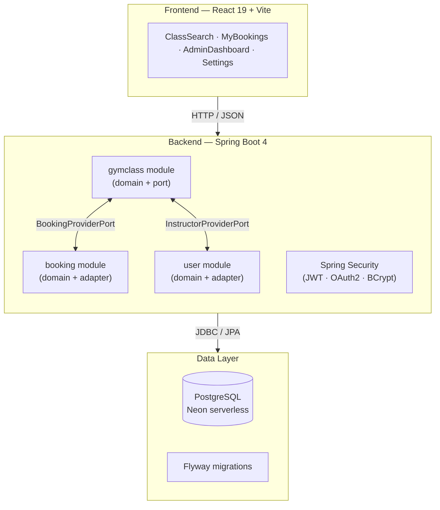

# boka.

[](https://openjdk.org/)
[](https://spring.io/projects/spring-boot)
[](https://reactjs.org/)
[](https://www.typescriptlang.org/)
[](https://www.postgresql.org/)
[](https://fly.io/)

**boka.** is a full-stack gym class booking platform built with Spring Boot 4 and React 19. It demonstrates production-grade backend patterns — hexagonal architecture, pessimistic locking, transactional booking flows — combined with a polished, responsive frontend.

**[Live demo](https://boka.fly.dev) · [API docs](https://boka.fly.dev/swagger-ui.html)**

---

## Architecture



Cross-module dependencies flow through explicit **ports** (interfaces), keeping the `gymclass`, `booking`, and `user` modules decoupled. Infrastructure adapters (`BookingProviderAdapter`, `InstructorProviderAdapter`) implement the ports and live at the boundary.

---

## Technical Highlights

**Backend**
- **Pessimistic locking** on the booking path (`SELECT ... FOR UPDATE`) prevents overbooking under concurrent load — the lock is acquired at the DB row level, capacity is checked inside the transaction, and `PessimisticLockingFailureException` is caught for a graceful user-facing error
- **Hexagonal / Ports & Adapters** architecture with Spring Modulith — each module exposes a typed port interface; no cross-module repository access
- **Schema-first with Flyway** — `ddl-auto=validate` in all environments; every schema change is a versioned migration
- **Admin booking cascade** — cancelling a class atomically cancels all confirmed bookings within the same transaction
- **Secure admin bootstrap** — admin credentials are injected via environment variables at startup; a force-sync flag controls password rotation; startup fails fast in production if credentials are absent

**Frontend**
- **React Router v6** deep-linking — every view has a stable URL; Spring Boot forwards unknown paths to `index.html` via a `SpaController`
- **Global toast system** — `ToastProvider` + `useToast` hook replaces all `alert()`/`window.confirm()` calls with styled, auto-dismissing notifications
- **Admin dashboard** — paginated class list with status filter tabs, inline cancel confirmation, and a create/edit modal with timezone-safe datetime handling
- **Google OAuth2** sign-in/sign-up alongside local credentials

**API**
- Interactive docs at `/swagger-ui.html` — all endpoints grouped by domain (Auth, Classes, Bookings, Gyms, Users, Admin)
- `GlobalExceptionHandler` maps Bean Validation errors to `{"message": "..."}` so clients get readable field error messages

---

## Features

| | |
|---|---|
| Browse gym classes with filters | Book a class with real-time availability |
| Cancel bookings with confirmation | Admin CRUD for gym classes |
| Assign instructors to classes | Cancel class + cascade-cancel all bookings |
| Google OAuth2 + local auth | Settings: update profile, delete account |

---

## Cloud & CI/CD

| Concern | Solution |
|---|---|
| Hosting | [Fly.io](https://fly.io/) — single Docker image (Spring Boot + React static assets) |
| Database | [Neon](https://neon.tech/) — serverless PostgreSQL |
| CI | GitHub Actions — build, test, frontend compile on every push |
| Deploy | GitHub Actions — `fly deploy` on merge to `main` |

---

## Getting Started

**Prerequisites:** JDK 25, Node.js 20+, Docker

```bash
npm run install:all   # install all dependencies
npm start             # starts Postgres (Docker), Spring Boot, and Vite concurrently
```

**Local credentials**
| Role | Email | Password |
|---|---|---|
| Admin | `admin@boka.se` | `password123` |
| Member | `karl@example.com` | `password123` |

Local API docs: `http://localhost:8080/swagger-ui.html`

---

## License

MIT
